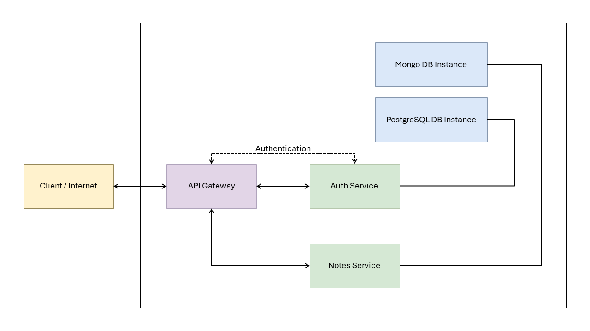

# Keep

I want to start by saying that this repository is not like any other. My goal here is to share my experience learning this architecture with Node.js, to assist students who are beginning their journey in software development. I hope it will be of great help to you.

## [What are microservices?](https://www.ibm.com/topics/microservices)

Microservices, or microservices architecture, is a cloud-native architectural approach in which a single application is composed of many loosely coupled and independently deployable smaller components or services.

Microservices typically:

- Have their own technology stack, inclusive of the database and data management model.
- Communicate with one another over a combination of representational state transfer (REST) APIs, event streaming and message brokers.
- Are organized by business capability, with the line separating services often referred to as a bounded context.

While much of the discussion about microservices has revolved around architectural definitions and characteristics, their value can be more commonly understood through fairly simple business and organizational benefits:

- Code can be updated more easily—new features or functionality can be added without touching the entire application.
- Teams can use different stacks and different programming languages for different components.
- Components can be scaled independently of one another, reducing the waste and cost associated with having to scale entire applications because a single feature might be facing too much load.

You can learn more about microservices in this [article from IBM.](https://www.ibm.com/topics/microservices)

## Getting started

## License

This project is under the MIT License - Refer to the file [LICENSE.md](LICENSE.md) for more details.
