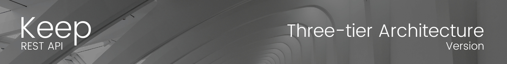
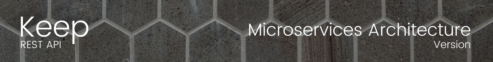
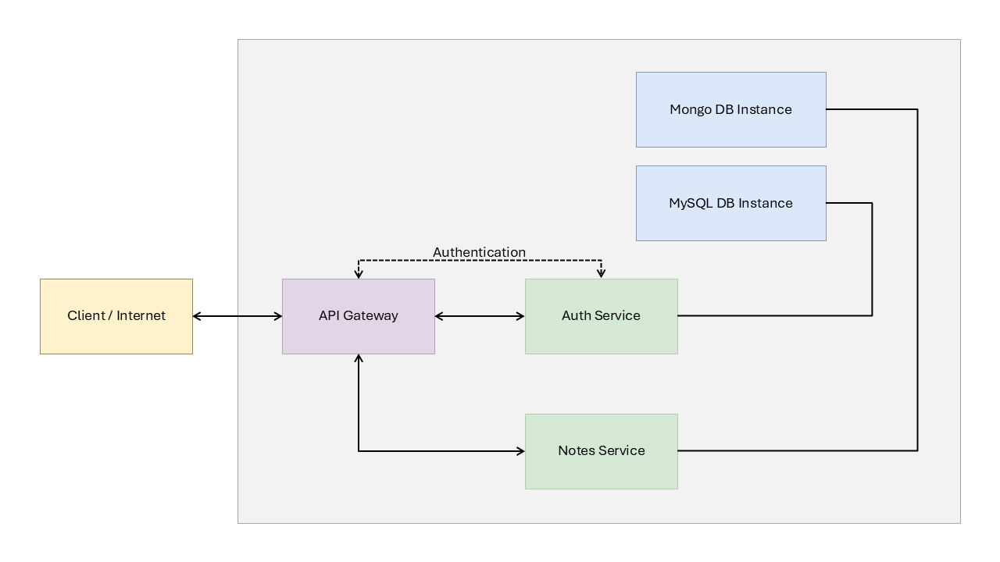

# Keep

I want to start by saying that this repository is not like any other. My goal here is to share my experience learning this architecture with Node.js, to assist students who are beginning their journey in software development. I hope it will be of great help to you.

## [What are microservices?](https://www.ibm.com/topics/microservices)

Microservices, or microservices architecture, is a cloud-native architectural approach in which a single application is composed of many loosely coupled and independently deployable smaller components or services.

Microservices typically:

- Have their own technology stack, inclusive of the database and data management model.
- Communicate with one another over a combination of representational state transfer (REST) APIs, event streaming and message brokers.
- Are organized by business capability, with the line separating services often referred to as a bounded context.

While much of the discussion about microservices has revolved around architectural definitions and characteristics, their value can be more commonly understood through fairly simple business and organizational benefits:

- Code can be updated more easily—new features or functionality can be added without touching the entire application.
- Teams can use different stacks and different programming languages for different components.
- Components can be scaled independently of one another, reducing the waste and cost associated with having to scale entire applications because a single feature might be facing too much load.

### Don’t build microservices

Stated more accurately, don’t start with microservices. Microservices are a way to manage complexity once applications have gotten too large and unwieldy to be updated and maintained easily. Only when you feel the pain and complexity of the monolith begin to creep in is it worth considering how you might refactor that application into smaller services. Until you feel that pain, you don’t even really have a monolith that needs refactoring.

---

You can learn more about microservices in this [article from IBM.](https://www.ibm.com/topics/microservices)

## [What is three-tier architecture?](https://www.ibm.com/topics/three-tier-architecture)

Three-tier architecture is a well-established software application architecture that organizes applications into three logical and physical computing tiers: the presentation tier, or user interface; the application tier, where data is processed; and the data tier, where application data is stored and managed.

The chief benefit of three-tier architecture is that because each tier runs on its own infrastructure, each tier can be developed simultaneously by a separate development team. And can be updated or scaled as needed without impacting the other tiers.

### Benefits of three-tier architecture

Again, the chief benefit of three-tier architecture is its logical and physical separation of functionality. Each tier can run on a separate operating system and server platform - for example, web server, application server, database server - that best fits its functional requirements. And each tier runs on at least one dedicated server hardware or virtual server, so the services of each tier can be customized and optimized without impacting the other tiers.

Other benefits (compared to single- or two-tier architecture) include:

- **Faster development:** Because each tier can be developed simultaneously by different teams, an organization can bring the application to market faster. And programmers can use the latest and best languages and tools for each tier.

- **Improved scalability:** Any tier can be scaled independently of the others as needed.

- **Improved reliability:** An outage in one tier is less likely to impact the availability or performance of the other tiers.

- **Improved security:** Because the presentation tier and data tier can't communicate directly, a well-designed application tier can function as an internal firewall, preventing SQL injections and other malicious exploits.

---

You can learn more about the three-tier architecture in this [article from IBM.](https://www.ibm.com/topics/three-tier-architecture)

Considering the previously mentioned points, I started developing the application using a three-layer architecture instead of directly opting for microservices. While microservices are often considered more convenient in the long term, a modularly designed application can easily scale to a microservices architecture without the need for significant refactoring. Below is the diagram of our system based on a three-tier architecture:

In the controller, we will manage everything related to HTTP, which means handling requests and responses from our endpoints. Additionally, we will use a lightweight Express router to direct requests to the corresponding controller.

All business logic will be implemented in the service layer, which will expose certain services (methods) to be used by the controller.

The third layer is the data access layer, where we will interact directly with the database.

The complete project, along with its detailed documentation, is available in the branch [keep/three-tier_architecture.](https://github.com/iamcarlosdaniel/Keep/tree/keep/three-tier_architecture)

> When reviewing the project's source code, you'll notice that, in addition to being developed on a three-layer architecture, it has been carefully modularized. This will ease its future refactoring into a microservices architecture, enabling a more efficient and organized transition.

---

Below is the diagram of our system based on a microservices architecture:

## Getting started

## License

This project is under the MIT License - Refer to the file [LICENSE](https://github.com/iamcarlosdaniel/Keep/blob/main/LICENSE) for more details.
